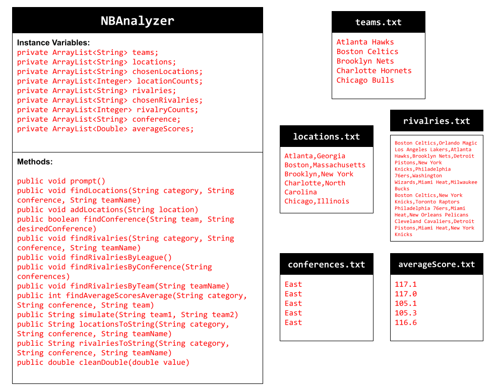
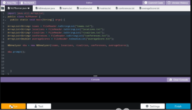

# Unit 6 - Natural Language Processing Project

## Introduction

Natural language processing (NLP) is used in many apps and devices to interact with users and make meaning of text to determine how to respond, find information, or to create new text. Your goal is to use natural language processing techniques to identify structure, patterns, and meaning in a text to have conversations with a user, execute commands, perform manipulations on the text, or generate new text.

## Requirements

Use your knowledge of object-oriented programming, ArrayLists, the String class, and algorithms to create a program that uses natural language processing techniques:

- **Create at least two ArrayLists** – Create at least two ArrayLists to store the data used in your program, such as data from text files or entered by the user.
- **Implement one or more algorithms** – Implement one or more algorithms that use loops and conditionals to find or manipulate elements in an ArrayList or String object.
- **Use methods in the String classs** - Use one or more methods in the String class in your program, such as to divide text into sentences or phrases.
- **Use at least one natural language processing technique** – Use a natural language processing technique to process, analyze, and/or generate text.
- **Document your code** – Use comments to explain the purpose of the methods and code segments and note any preconditions and postconditions.

## UML Diagram

Put and image of your UML Diagram here. Upload the image of your UML Diagram to your repository, then use the Markdown syntax to insert your image here. Make sure your image file name is one word, otherwise it might not properly get display on this README.

## Video

Record a short video of your project to display here on your README. You can do this by:

- Screen record your project running on Code.org.
- Upload that recording to YouTube.
- Take a thumbnail for your image.
- Upload the thumbnail image to your repo.
- Use the following markdown code:

## Project Description

Write a description of the goal and/or problem that your application. Include descriptions of what text is being analyzed, either if its text files you are using to interpret text an how the user interacts with your project.

The goal of my application is to allow the user to access data on the NBA from team names, locations, rivalries, and average scores. It also allows the user to simulate matches between different teams similarly to a video game. To gather data, I accessed the NBA website and typed all the data into the program myself in aplhabetical order of the teams' names. The text being analyzed comes primarily from the user. The user is the one who provides what data they want to search for and what range they want to access data in (ranging from the whole NBA to individual teams). Based on this input, certain methods are executed to find the requested data in the requested range (all of which are listed in the NBAnalyzer.java file). In terms of simulating matches, the data from the .txt files are processed to find which team is more likely to win based off their average score and the possible fluctuation in points between the simulation and a real match. Another example of .txt files being analyzed is when data on locations is requested, which is when Java methods such as substring() and indexOf() are used to find the state of each team and record each state.

## NLP Techniques

Write a description of what natural lanugage technique (NLP) you implemented in your project. State which methods in your project are associated with this, and a brief explanation of how those methods word and how they are necessary in the NLP technique. 

Overall, the main NLP technique I included in my project was text generation. There are three main methods that showcase this technique in my project: prompt(), locationsToString(), and rivalriesToString(). The first of the three is used to ask the user questions on what data they would like to see. It first asks what range they wish to view, then asks what data they wish to view. Based on that second input, methods such as the other two listed or the findAverageScores() method will execute using teams in the given range. If the range picked was conference, it would then ask the user for a conference to analyze and provide the same data options. If the range was team, it would then ask for a team to analyze. The locationsToString() method is responsible for gathering all the locations of teams in a given range (and a given conference and team if the range was either of those) by calling seperate methods to form the list. With the range and possibly the name of the team/conference provided, it would generate the locations of all applicable teams. For example, the range NBA and a call to this method would list every location with an NBA team and how many teams are in it (ex. California has 4 teams). The rivalriesToString() is quite similar to the previously mentioned method, except it has a different method for each range to develop the list of rivalries and how many rivalries a certain team has in the given range mainly to facilitate the restrictions of each range (conference for example only calls for teams in one certain conference). Methods like contains(), indexOf(), and split() are used to divide each rivalry in each list of rivalries into its own element and account for it, which can be either adding it for the first time or increasing its mentions count at the respective index of where the location was first added. All of these methods are examples of how user input can generate varying results based on different inputs such as the range, the conference, and/or the team name.
